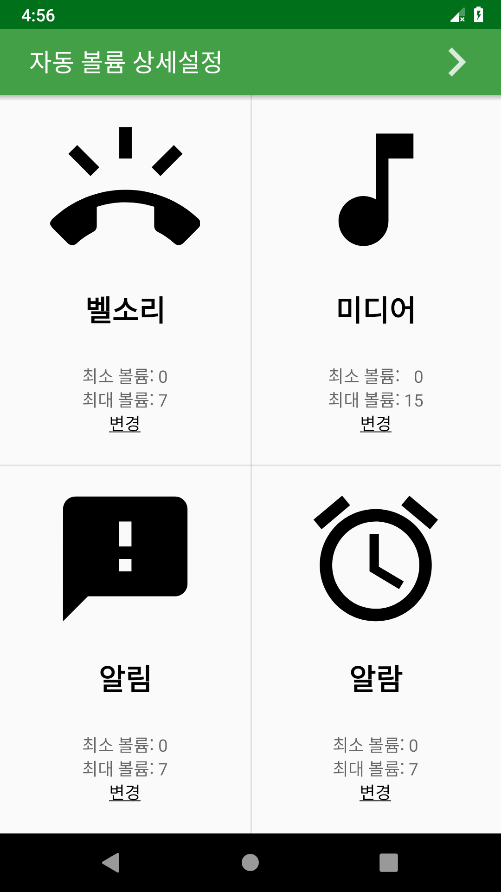
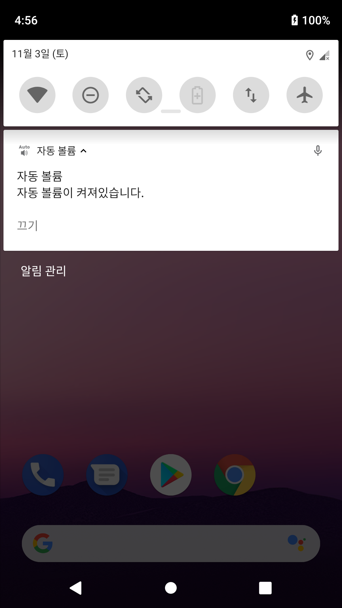
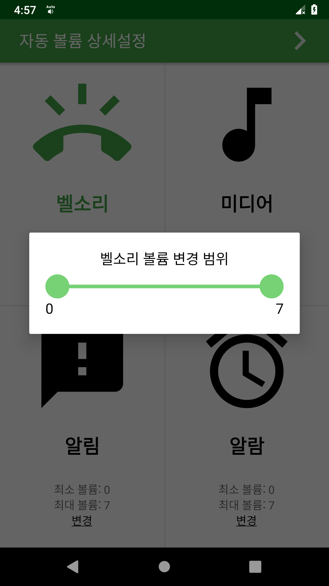
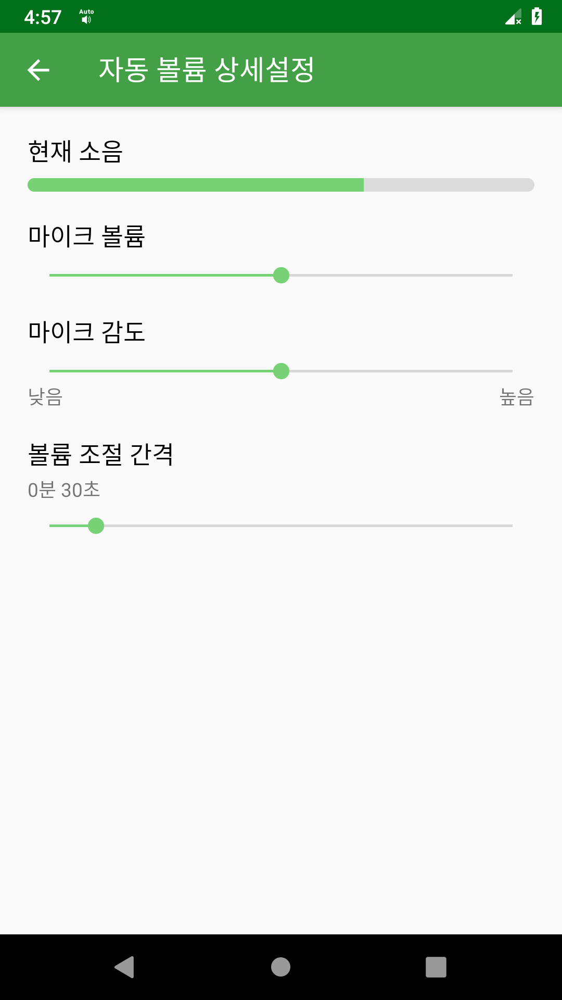

AutoVolume
===
사용자의 주변 소음을 인식하여 자동으로 기기 내 볼륨을 조절해 주는 앱  

안드로이드 개발을 공부하고 처음으로 진행했던 프로젝트입니다. 시간이 나면 전체적으로 리팩토링 할 계획입니다.  

## 메인화면
볼륨별로 자동 조절 기능을 on/off 할 수 있습니다.  
켜면 해당 아이콘의 색상이 초록색으로 변합니다.  
</img>

## 볼륨 변경 범위
최소볼륨, 최대볼륨 밑에 변경 버튼을 누르면 볼륨이 자동으로 조절될 범위를 정할 수 있습니다.  
</img>

## 알림
4개중 하나라도 키면 이런 알림이 뜨며, 끄기 버튼으로 모두 끌 수 있습니다.  
</img>

## 상세설정
상단의 버튼을 눌러 이 화면으로 들어오면 마이크 볼륨, 감도, 볼륨이 자동으로 조절될 주기를 설정할 수 있습니다.  
</img>
